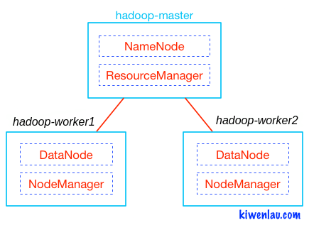

# Run Hadoop Cluster within Docker



## 3 Nodes (1 master and 2 workers) Hadoop Cluster

### 1. Clone Repository

```bash
git clone https://github.com/cihatislamdede/bigdata-hadoop-cluster
```

### 2. Start containers

```bash
sudo chmod +x start.sh
./start.sh
```

```bash
start hadoop-master container...
start hadoop-slave1 container...
start hadoop-slave2 container...
root@hadoop-master:~# 
```

### 3. Start hadoop cluster

```bash
./start-hadoop.sh
```

### 4. Create input folders

```bash
./create_input_folders.sh
```

### 5. Some useful commands

- copy source code to hadoop cluster

```bash
docker cp BigData/ hadoop-master:/root
```

- docker first run and average job run

```bash
cd BigData
mvn package
cd ..
cp BigData/target/BigData-1.0.jar input/
hdfs dfs -put -f input/BigData-1.0.jar input/ 
# Usage: <input> <output> <reducer> <key_idx> <value_idx>
hadoop jar input/BigData-1.0.jar org.example.Main <input> <output> <reducer> <key_idx> <value_idx>
hdfs dfs -cat <output>/*
```

### 6. Clear all environment

```bash
./clear.sh
```

### 7. References

- Dataset: [Goodreads Book Datasets With User Rating 2M | Kaggle](https://www.kaggle.com/datasets/bahramjannesarr/goodreads-book-datasets-10m)
- [Run Hadoop Custer within Docker Containers](https://github.com/kiwenlau/hadoop-cluster-docker)
- [Essential Docker Commands](https://towardsdatascience.com/12-essential-docker-commands-you-should-know-c2d5a7751bb5)
- [Installation Of Multi-Node Hadoop 3.2.1 Cluster on a Single Machine](https://yashpatil516.medium.com/installation-of-multi-node-hadoop-3-2-1-cluster-on-a-single-machine-fa42e85f7d14)
- [Hadoop Mapreduce](https://www.tutorialspoint.com/hadoop/hadoop_mapreduce.htm)
- [average-calculation-map-reduce](https://github.com/a-Imantha/average-calculation-map-reduce)
